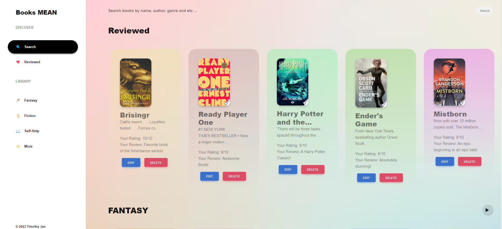
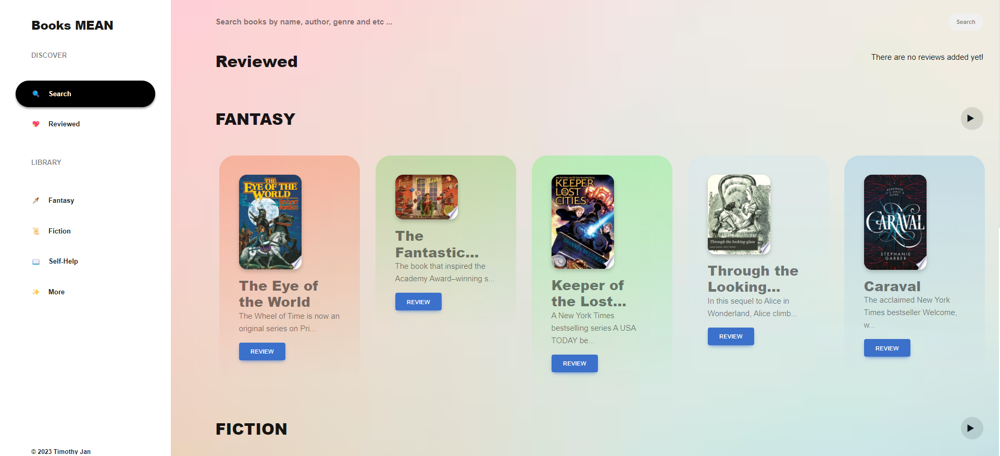
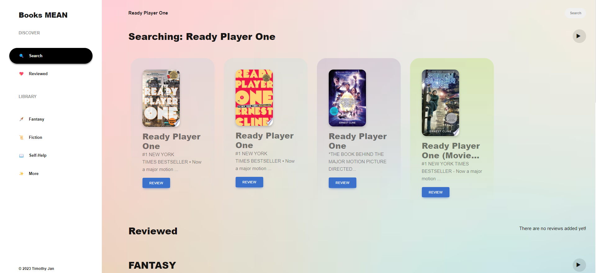
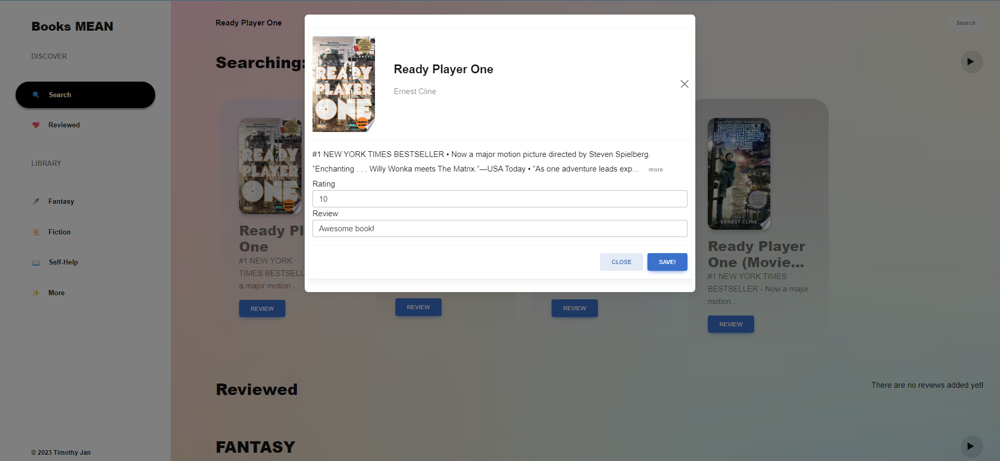
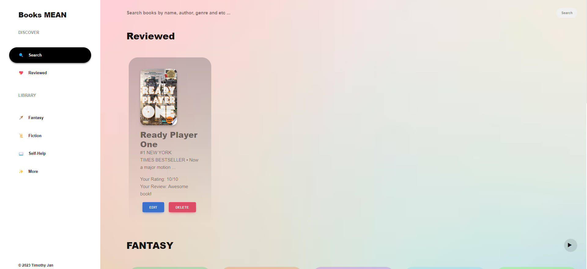
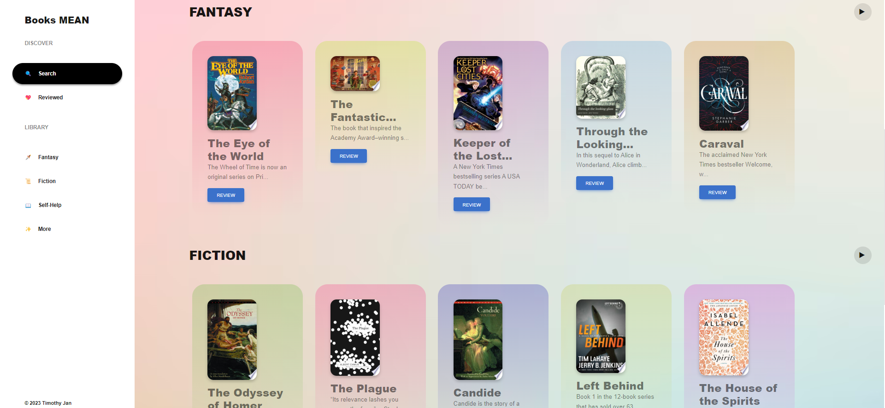

# Books-MEAN
Book management system - Angular MEAN CRUD app using Google Books API, MongoDB, Express, Angular, Node, and MDBootstrap 5.

Backend(/backend):
<ul>
  <li>Start Server ~<code>nodemon server</code></li>
  <li>Start the MondoDB server ~<code>mongosh</code></li>
  <li>API URL - <a href="http://localhost:4000/api">http://localhost:4000/api</a></li>
</ul>

Frontend:
<ul>
  <li>Start Frontend ~<code>ng serve</code></li>
  <li>Angular frontend - <a href="http://localhost:4200">http://localhost:4200</a></li>
  <li><a href="https://mdbootstrap.com/docs/standard/getting-started/installation/">Mdbootstrap Installation</a></li>
</ul>

<h3>Some of my fav books</h3>

<h3>Home</h3>

<h3>Search</h3>

<h3>Review</h3>

<h3>Review-List</h3>

<h3>Explore Other Genres!</h3>
